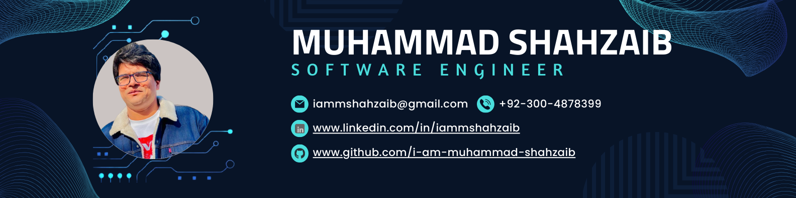

## Hi there 👋

<!--
**immshahzaib/immshahzaib** is a ✨ _special_ ✨ repository because its `README.md` (this file) appears on your GitHub profile.

Here are some ideas to get you started:

- 🔭 I’m currently working
- 🌱 I’m currently learning Laravel, Rest-API, SQL, Vue, Vuex, PINIA, Vite, Nuxt, Vuetify, Javascript, Tailwind, Bootstrap, Figma, PSD to HTML.
- 👯 I’m looking to collaborate on Laravel, Rest-API, SQL, Vue, Vuex, PINIA, Vite, Nuxt, Vuetify, Javascript, Tailwind, Bootstrap, Figma, PSD to HTML.
- 🤔 I’m looking for help with Laravel, Rest-API, SQL, Vue, Vuex, PINIA, Vite, Nuxt, Vuetify, Javascript, Tailwind, Bootstrap, Figma, PSD to HTML.
- 💬 Ask me about Laravel, Rest-API, SQL, Vue, Vuex, PINIA, Vite, Nuxt, Vuetify, Javascript, Tailwind, Bootstrap, Figma, PSD to HTML.
- 📫 How to reach me: iammshahzaib@gmail.com
- 😄 Pronouns: Shahzaib
- ⚡ Fun fact: Hard Worker
-->

I'm a passionate **Senior Software Engineer** with over 10 years of experience in web application development. I enjoy building efficient, scalable solutions and am always eager to learn and share knowledge with the community.

### 🛠️ My Specializations
- **Front-End:** Vue.js, Vue-Router, Nuxt.js, Vuetify, Tailwind CSS, Bootstrap, JavaScript, jQuery
- **State Management:** VUEX, PINIA
- **Back-End:** Laravel, REST APIs, PHP, Passport, MeiliSearch
- **Database:** MySQL
- **Payment Integrations:** Chargebee, Stripe, UTP
- **Tools & Integrations:** Pusher.js, KONVA-JS, WordPress, Git, Slack, Jira
- **Version Control:** GitHub, Bitbucket

### 💬 Let’s Connect!
I love discussing software engineering, new tech, and impactful projects. Feel free to connect with me:

.pdf)

### 📊 GitHub Stats

Thanks for stopping by! Looking forward to connecting and building awesome things together 🚀
